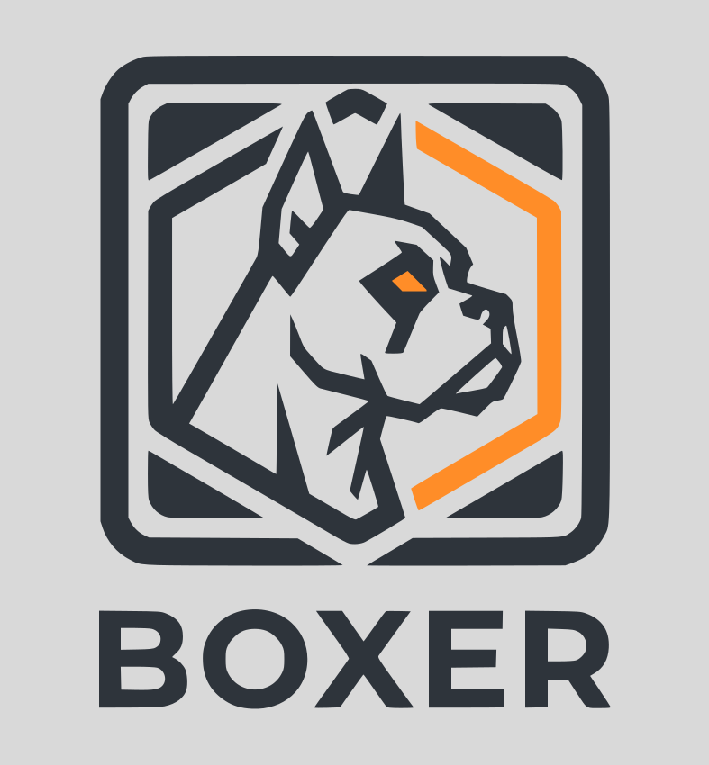

<p align="center">
  
</p>

<h3 align="center">Sandboxed container execution powered by gVisor</h3>

<p align="center">
  <a href="LICENSE"></a>
  <a href="packages/core/go.mod"></a>
  <a href="https://pypi.org/project/boxer-sdk/"></a>
  <a href="https://theonekeyg.github.io/boxer/"></a>
</p>

<p align="center">
  <a href="https://theonekeyg.github.io/boxer/">Documentation</a> &nbsp;·&nbsp;
  <a href="#getting-started">Quick Start</a> &nbsp;·&nbsp;
  <a href="https://github.com/theonekeyg/boxer/issues">Issues</a>
</p>

---

Boxer is a sandboxed container execution service backed by [gVisor](https://gvisor.dev/). It exposes a simple HTTP API for running arbitrary commands inside any container image, with strong isolation guarantees and configurable resource limits.

## Why Boxer

Running untrusted code is a hard problem. Docker alone provides namespace isolation but shares the host kernel - a compromised container can exploit kernel vulnerabilities and escape. Boxer wraps every execution in gVisor's user-space kernel (`runsc`), which intercepts and validates all system calls before they reach the host. The attack surface is dramatically reduced.

This makes Boxer a good fit for:

- **LLM training and inference pipelines** - execute model-generated code safely without exposing your host to arbitrary syscalls
- **Decentralized oracle evaluations** - run untrusted verification scripts submitted by network participants
- **Prediction markets and agent frameworks** - evaluate outcomes by executing code from unknown sources
- **Code execution as a service** - any scenario where you need to run unstructured, user-supplied, or LLM-generated code at scale

## How It Works

1. A client sends a `POST /run` request with a container image, command, optional files, and resource limits.
2. Boxer pulls and caches the image rootfs locally (shared read-only across executions).
3. It constructs a hardened OCI bundle and spawns `runsc` (gVisor) to execute the command.
4. Stdout, stderr, wall time, and exit code are returned in the response.

Files can be uploaded before a run and bind-mounted read-only inside the container. Output files written to `/output/` inside the container are captured and retrievable after the run.

## Getting Started

### Prerequisites

- [gVisor `runsc`](https://gvisor.dev/docs/user_guide/install/) installed and in `PATH`
- Go 1.22+

### Run the server

```bash
cd packages/core
go run . --config config.dev.json
```

The server listens on `:8080` by default. Configuration can also be set via `$BOXER_CONFIG` or `~/.boxer/config.json`.

### Python SDK

```bash
pip install boxer-sdk
```

```python
from boxer import BoxerClient

with BoxerClient("http://localhost:8080") as client:
    result = client.run(
        image="python:3.12-slim",
        cmd=["python3", "-c", "print('hello world')"],
    )
    print(result.stdout)    # hello world
    print(result.exit_code) # 0
    print(result.wall_ms)   # e.g. 312
```

See [`packages/sdk/python`](packages/sdk/python) for the full SDK reference including async support, file upload/download, resource limits, and error handling.

### REST API

```bash
curl -s http://localhost:8080/run \
  -H 'Content-Type: application/json' \
  -d '{"image":"python:3.12-slim","cmd":["python3","-c","print(42)"]}'
```

Swagger UI is available at `http://localhost:8080/swagger`.

## Examples

### [`examples/hello-world`](examples/hello-world)

Minimal Python script that runs a sandboxed "hello world" via the Boxer SDK. Good starting point for understanding the basic client flow.

### [`examples/upload-and-run`](examples/upload-and-run)

Uploads a local Python project (source + tests) to Boxer and runs its pytest suite inside a sandboxed container. Demonstrates the file upload workflow and output capture.

### [`examples/humaneval`](examples/humaneval)

Evaluates OpenAI's `o3-mini` on the [HumanEval](https://github.com/openai/human-eval) benchmark (164 code-generation problems). Each LLM-generated solution is executed inside the Boxer sandbox and scored by exit code. A real-world example of using Boxer in an LLM evaluation pipeline.

## Contributing

Before writing any code, please check the [open issues](../../issues). If your bug report, feature request, or proposal is not already tracked there, open an issue first and describe what you want to do. Once the issue is confirmed, open a pull request that references it.

This keeps discussion focused, avoids duplicate work, and ensures effort is spent on changes that will be accepted.
